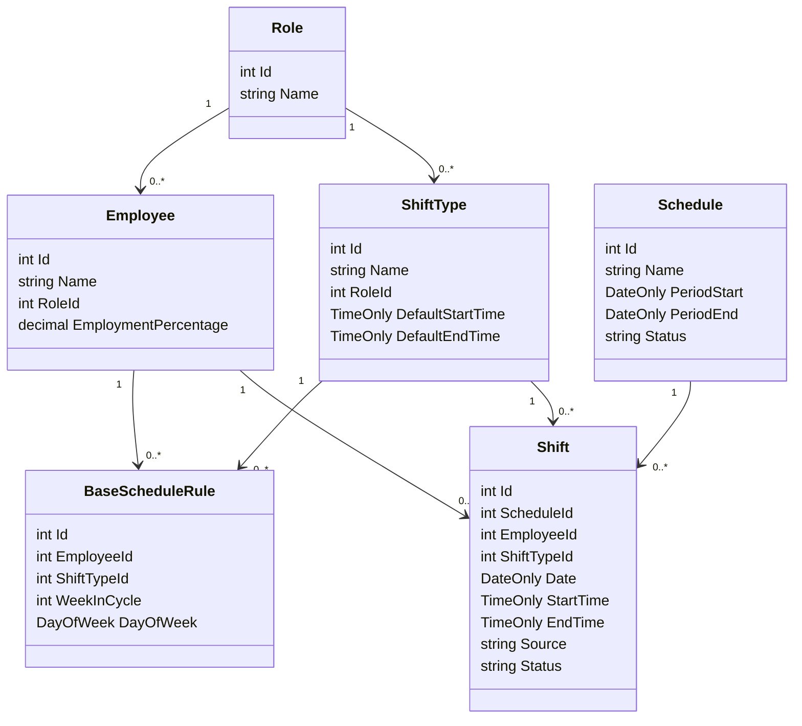
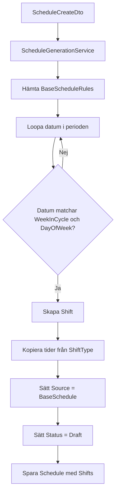

# Domain Model

Det här dokumentet beskriver domänmodellen, relationerna och de viktigaste invariants i schemaläggningssystemet.

## Kärnmodell



## Relationer

| Relation | Betydelse |
| --- | --- |
| `Role` 1..* `Employee` | En roll kan ha flera anställda. |
| `Role` 1..* `ShiftType` | En roll kan ha flera passtyper, och rollen avgör vilka passtyper en anställd får arbeta. |
| `Employee` 1..* `BaseScheduleRule` | En anställd kan ha flera grundschemaregler. |
| `ShiftType` 1..* `BaseScheduleRule` | En passtyp kan användas i flera grundschemaregler. |
| `Schedule` 1..* `Shift` | Ett schema innehåller faktiska pass. |
| `Employee` 1..* `Shift` | En anställd kan ha flera faktiska pass. |
| `ShiftType` 1..* `Shift` | Ett pass vet vilken passtyp det skapades från. |

## Entiteter

### Employee

Representerar en anställd.

Fält:

- `Id`
- `Name`
- `RoleId`
- `EmploymentPercentage`

Relationer:

- hör till en `Role`
- har återkommande regler via `BaseScheduleRule`
- har faktiska pass via `Shift`

### ShiftType

Representerar en passtyp eller mall, exempelvis Öppning, Stängning, Kassa eller Lager.

Fält:

- `Id`
- `Name`
- `RoleId`
- `DefaultStartTime`
- `DefaultEndTime`

Relationer:

- hör till en `Role`

Viktig regel:

- En anställd får arbeta passtypen om `Employee.RoleId` matchar `ShiftType.RoleId`.
- `DefaultStartTime` och `DefaultEndTime` kopieras till `Shift.StartTime` och `Shift.EndTime` vid schemagenerering.
- Redan genererade pass ska inte ändras automatiskt om passtypens standardtider ändras senare.

### BaseScheduleRule

Representerar en återkommande grundschemaregel i en fyraveckorscykel.

Fält:

- `Id`
- `EmployeeId`
- `ShiftTypeId`
- `WeekInCycle`
- `DayOfWeek`

Exempel:

```text
Anna arbetar Öppning vecka 1 på måndagar.
```

Viktig regel:

- En anställd ska bara ha en grundregel per kombination av `WeekInCycle` och `DayOfWeek` i V1.
- Regeln måste referera till en passtyp som matchar den anställdas roll.
- `WeekInCycle` är 1 till 4.

### Schedule

Representerar ett schema för en specifik period.

Fält:

- `Id`
- `Name`
- `PeriodStart`
- `PeriodEnd`
- `Status`

Status:

- `Draft`
- `Published`

Viktig regel:

- Scheman skapas som `Draft`.
- När ett schema publiceras ändras status till `Published`.

### Shift

Representerar ett faktiskt arbetspass i ett schema.

Fält:

- `Id`
- `ScheduleId`
- `EmployeeId`
- `ShiftTypeId`
- `Date`
- `StartTime`
- `EndTime`
- `Source`
- `Status`

Viktig regel:

- `StartTime` och `EndTime` är egna värden på passet.
- De ska inte läsas live från `ShiftType` efter att passet har genererats.
- Ett pass kan redigeras utan att passtypen eller grundschemat ändras.

## Genereringsflöde



## Skillnad mellan mall och kopia

```text
ShiftType
Öppning 08:00-16:00
        |
        | kopieras vid generering
        v
Shift
2026-06-15 Anna 08:00-16:00
        |
        | manuell ändring
        v
Shift
2026-06-15 Anna 09:00-16:00
```

Efter den manuella ändringen gäller:

- `ShiftType` är fortfarande Öppning 08:00-16:00.
- `BaseScheduleRule` är fortfarande Anna arbetar Öppning vecka 1 på måndagar.
- Endast det faktiska passet för `2026-06-15` har ändrats.
